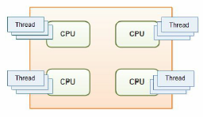
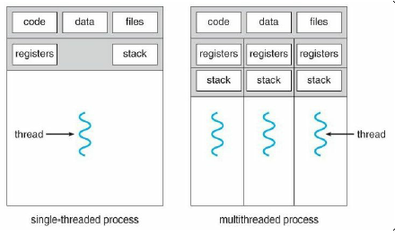
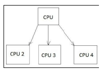
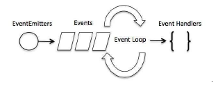
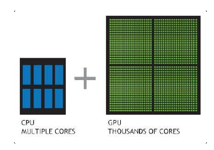
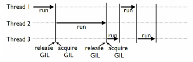

# Learning Concurrency in Python by Elliot Forbes

## 1. Speed It Up!
## 2. Parallelize It
## 3. Life of a Thread
## 4. Synchronization between Threads
## 5. Communication between Threads
## 6. Debug and Benchmark
## 7. Executors and Pools
## 8. Multiprocessing
## 9. Event-Driven Programming
## 10. Reactive Programming
## 11. Uing the GPU
## 12. Choosing a Solution

---
---

# 1. Speed It Up!

```>```

## What is a thread ?

**A thread can be defined as an ordered stream of instructions that can be scheduled to run as such by operating systems**. These threads, typically, **live within processes**, and consist of a program counter, a stack, and a set of registers as well as an identifier. **These threads aare the smallest unit of execution to which a processor can allocate time.**

**Threads are able to interact with shared resources, and communication is possible between multiple threads. They are also able to share memory, and read and write different memory addresses, but therein lies an issue.** When two threads start sharing memory, and you have no  way to guarantee the order of a thread's execution, you could start seeing issues or minot bugs that give you the wrong values or crash your system altogether.

The following figure shows how multiple threads can exist on multiple different CPUs:



## Types of threads

Withing a typical operating system, we, typically, have two distinct types of threads:

* **User-level threads:** Threads that we can actively create, run, and kill for all of our various tasks
* **Kernel-level threads:** Very low-level threads acting o behalf of the operating system

Python works at the user-level, and thus, everything we cover in this book will be, primarily, focused on these user-level threads.

## What is multithreading?

When people talk about multithreaded processors, they are typically referring to a processor that can run multiple threads **simultaneously**, which they are able to do by utilizing a single core that is able to very quickly switch context between multiple threads. This switching context takes place in such a small amount of time that **we could be forgiven for thinking that multiple threads are running in parallel when, in fact, they are not.**

### Analogy for multithreading

When trying to understand multithreading, it's best if you think of a multithreaded program as an office. In a single-threaded program, there would only be one person working in this office at all times, handling all the work in a sequential manner. This would become an issue if we consider what happens when this solitary worker becomes bogged down with administrative paperwork, and is unable to move on to different work. They would be unable to cope, and wouldn't be able to deal with new incoming sales, thus costing our metaphorical business money.

With multithreading, our single solitary worker becomes an excellent multitasker, and is able to work on multiple things at different items. They can make progress on some paperwork, and then switch context to a new task when something starts preventing them from doing further work on said paperwork. By being able to switch context when something is blocking them, they are able to do far more work in a short period of time, and thus make our business more money.

In this example, it's important to note that **we are still limited to only one worker or processing core.** If we wanted to try and improve the amount of work that hte business could do and complete work in parallel, then we would have to employ other workers or processes as we would call them in Python.

## Advantages and disadvantages of threading

Advantages of threading:

* Multiple threads are excellent for speeding up blocking I/O bound programs
* They are lightweight in terms of memory footprint when compared to processes
* Threads share resources, and thus communication between them is easier

Disadvantages of threading:

* CPython threads are hamstrung by the limitations of the **global interpreter lock (GIL)**
* While communication between threads may be easier, you must be very careful not to implement code that is subject to race conditions
* It's computationally expensive to switch context between multiple threads. By adding multiple threads, you could see a degradation in your program's overall performance.

## Processes

Processes are very similar in nature to threads -- they allow us to do pretty much everything a thread can do -- **but the one key advantages is that they are not bound to a singular CPU core**. If we extend our office analogy further, this, essentially, means that if we had a four core CPU, then we can hire two dedicated sales team members and two workers, and all four of them would be able to execute work in parallel. Processes also happen to be capable of working on multiple things at one time much as our multithreaded single office worker.

**These processes contain one main rpimary thread, but can spawn multiple sub-threads that each contain their own set of reigsters and a stack. They can become multithreaded should you wish. All processes provide every resource that the computer needs in order to execute a program.**

In the following image, you'll see two side-by-side diagrams; **both are examples of a process**. You'll notciec that the process on the left contains only one thread, otherwise known as the primary thread. The process on the right contains multiple htreads, each with their own set of registers and stacks:



With processes, we can improve the speed of our programs in specific scenarios where our programs are CPU bound, and require more CPU horsepower. However, by spawning multiple processes, we face new challenges with regard to cross-process communiation, and ensuring that we don't hamepr performance by spending too much time on this **interprocess communication (IPC).**

## Properties of processes

UNIX processes are craeted by the operating system, and typically contain the following:

* Process ID, process group ID, user ID, and group ID
* Environment
* Working directory
* Program instructions
* Registers
* Stack
* Heap
* File descriptors
* Signal actions
* Shared libraries
* Inter-process communication tools (such as message queues, pipes, semaphores, or shared memory)

## Advantages and disadvantages of processes

The advantages of processes are:

* Processes can make better use of multi-core processors
* They are better than multiple threads at handling CPU-intesive tasks
* We can sidestep the limitations of the GIL by spawning multiple processes
* Crashing procesess will not kill our entire program

The disadvantages of processes are:

* No shared resources between processes -- we have to implement soem form of IPC
* These require more memory

## Multiprocessing

In Python, we can choos eto run our code using either multiple threads or multiple processes should we wish to try and improve the performacne over a standard single-htreaded approach. We can go with a multithreaded approach and be limited to the processing power of one CPU core, or conversely we can go with a multiprocessing approach and utilize the full number of CPU cores avaialbe on our machine. In today's mdoern computers, we tend to have numerous CPUs and cores, so limiting ourselves to just the one, effectively redneres the rest of our machine idle. Our goal is to try and extract the full potential from our hardware, and ensure that we get the best value ofr money and solve our problems faster than anyone else:



With Python's multirpcoessing module, we can effectively utilize the full number of cores and CPUs, whcih can help us to achieve greater performance when it comes to CPU-bounded problems. the prceding figure shows an example of how one CPU core starts delegating tasks to other cores.

In all Python versions les s than or equal to 2.6, we can attain the number of CPU cores available to use by uinsg the following code snippet:

```Python
import multiprocessing

print(multiprocessing.cpu_count())
```

Not only does multiprocessing enable us to utilize more of our machine, but we also avoid the limitations that the Global Interpreter Lock imopses on us in CPython.

One potential disadvantages of multiple processes is that we inherently have no shared state, and lack communication. We, therefore, have to pass it through some form of IPC, and perfromacne caan take a hit. However, this lack of shared state can make them easier to work with, as you do not have to fight against potential race conditions in your code.

## Event-driven programming

Event-driven programming is a huge part of our lives--we see examples of it every day when we open up our phone, or work on our computer. These devices run purely in an event-driven way; for example, when you click on an icon on your desktop, the operating system registers this as an event, and then performs the necessary action tied to that specific style of event.

Every interaction we do can be characterized as an event or a series of events, and these typically trigger callbacks. If you have any prior experience with JavaScript, then you should be somewhat familiar with this concept of callbacks and the callback design pattern. In JavaScript, the predominant use case for callbacks is when you perform RESTful HTTP requests, and want to be able to perform an action when you know that this action has successfully completed and we've received our HTTP response:



If we look at the previous image, it shows us an example of how event-driven programs process events. We have our EventEmitters on the left-hand side; these fire off multiple Events, which are picked up by our program's Event Loop, and, should they match a predefined Event Handler, that handler is then fired to deal with the said event.

Callbacks are often used in scenarios where an action is asynchronous. Say, for instance, you applied for a job at Google, you would give them an email address, and they would then get in touch with you when they make their mind up. This is, essentially, the same as registering a callback except that, instead of having them email you, you would execute an arbitrary bit of code whenever the callback is invoked.

## GPU Programming

GPUs are renowned for their ability to render high resolution, fast action video games. They are able to crunch together the millions of necessary calculations per second in order to ensure that every vertex of your game's 3D models are in the right place, and that they are updated every few milliseconds in order to ensure a smooth 60 FPS.

Generally speaking, GPUs are incredibly good at performing the same task in parallel, millions upon millions of times per minute. But if GPUs are so performant, then why do we not employ them instead of our CPUs? While GPUs may be incredibly performant at graphics processing, they aren't however designed for handling the intricacies of running an operating system and general purpose computing. CPUs have fewer cores, which are specifically designed for speed when it comes to switching context between operating tasks. If GPUs were given the same tasks, you would see a considerable degradation in your computer's overall performance.

But how can we utilize these high-powered graphics cards for something other than graphical programming? This is where libraries such as PyCUDA, OpenCL, and Theano come into play. These libraries try to abstract away the complicated low-level code that graphics APIs have to interact with in order to utilize the GPU. They make it far simpler for us to repurpose the thousands of smaller processing cores available on the GPU, and utilize them for our computationally expensive programs:



These Graphics Processing Units (GPU) encapsulate everything that scripting languages are not. They are highly parallelizable, and built for maximum throughput. By utilizing these in Python, we are able to get the best of both worlds. We can utilize a language that is favored by millions due to its ease of use, and also make our programs incredibly performant.

In the following sections, we will have a look at the various libraries that are available to us, which expose the power of the GPU.

### PyCUDA

PyCUDA allows us to interact with Nvidia's CUDA parallel computation API in Python. It offers us a lot of different advantages over other frameworks that expose the same underlying CUDA API. These advantages include things such as an impressive underlying speed, complete control of the CUDA's driver API, and most importantly, a lot of useful documentation to help those just getting started with it.

Unfortunately however, the main limitation for PyCUDA is the fact that it utilizes Nvidia-specific APIs, and as such, if you do not have a Nvidia-based graphics card, then you will not be able to take advantage of it. However, there are other alternatives which do an equally good job on other non-Nvidia graphics cards.

### OpenCL

OpenCL is one such example of an alternative to PyCUDA, and, in fact, I would recommend this over PyCUDA due to its impressive range of conformant implementations, which does also include Nvidia. OpenCL was originally conceived by Apple, and allows us to take advantage of a number of heterogeneous platforms such as CPUs, GPUs, digital signal processors, field-programmable gate arrays, and other different types of processors and hardware accelerators.

There currently exist third-party APIs for not only Python, but also Java and .NET, and it is therefore ideal for researchers and those of us who wish to utilize the full power of our desktop machines.

### Theano

Theano is another example of a library that allows you to utilize the GPU as well as to achieve speeds that rival C implementations when trying to solve problems that involve huge quantities of data.

It's a different style of programming, though, in the sense that Python is the medium in which you craft expressions that can be passed into Theano.

## The limtations of Python

Earlier in the chapter, I talked about the limitations of the GIL or the Global Interpreter Lock that is present within Python, but what does this actually mean?

First, I think it's important to know exactly what the GIL does for us. The GIL is essentially a mutual exclusion lock which prevents multiple threads from executing Python code in parallel. It is a lock that can only be held by one thread at any one time, and if you wanted a thread to execute its own code, then it would first have to acquire the lock before it could proceed to execute its own code. The advantage that this gives us is that while it is locked, nothing else can run at the same time:



In the preceding diagram, we see an example of how multiple threads are hampered by this GIL. Each thread has to wait and acquire the GIL before it can progress further, and then release the GIL, typically before it has had a chance to complete its work. It follows a random round-robin approach, and you have no guarantees as to which thread will acquire the lock first.

Why is this necessary, you might ask? Well, the GIL has been a longdisputed part of Python, and over the years has triggered many a debate over its usefulness. But it was implemented with good intentions and to combat the non-thread safe Python memory management. It prevents us from taking advantage of multiprocessor systems in certain scenarios.

It must also be noted that there are other implementations of Python, such as Jython and IronPython, that don't feature any form of Global Interpreter Lock, and as such can fully exploit multiprocessor systems. Jython and IronPython both run on different virtual machines, so, they can take advantage of their respective runtime environments.

### Jython

Jython is an implementation of Python that works directly with the Java platform. It can be used in a complementary fashion with Java as a scripting language, and has been shown to outperform CPython, which is the standard implementation of Python, when working with some large datasets. For the majority of stuff though, CPython's single-core execution typically outperforms Jython and its multicore approach.

The advantage to using Jython is that you can do some pretty cool things with it when working in Java, such as import existing Java libraries and frameworks, and use them as though they were part of your Python code.

### IronPython

IronPython is the .NET equivalent of Jython and works on top of Microsoft's .NET framework. Again, you'll be able to use it in a complementary fashion with .NET applications. This is somewhat beneficial for .NET developers, as they are able to use Python as a fast and expressive scripting language within their .NET applications