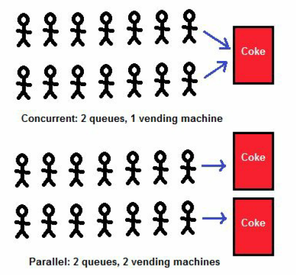
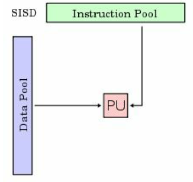
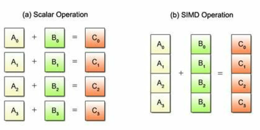
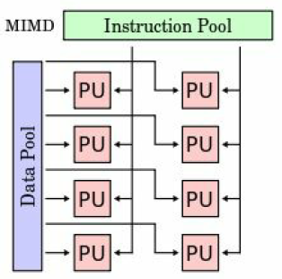
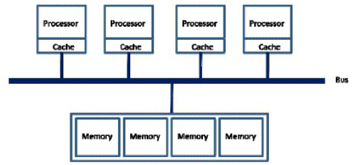
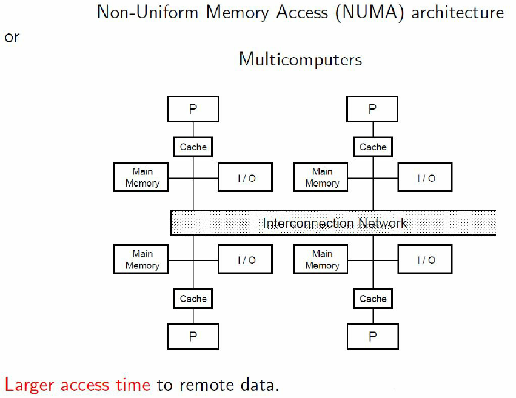
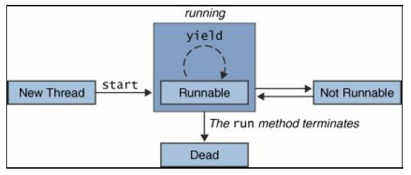
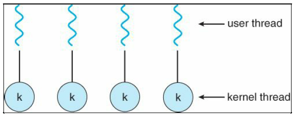
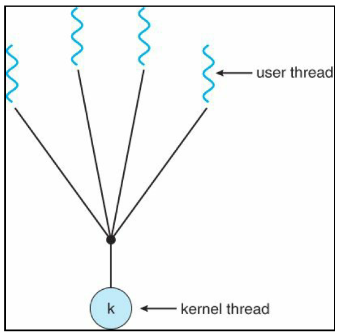

# Learning Concurrency in Python by Elliot Forbes

## 1. Speed It Up!
## 2. Parallelize It
## 3. Life of a Thread
## 4. Synchronization between Threads
## 5. Communication between Threads
## 6. Debug and Benchmark
## 7. Executors and Pools
## 8. Multiprocessing
## 9. Event-Driven Programming
## 10. Reactive Programming
## 11. Using the GPU
## 12. Choosing a Solution

---
---

# 1. Speed It Up!

```>```

## What is a thread ?

**A thread can be defined as an ordered stream of instructions that can be scheduled to run as such by operating systems**. These threads, typically, **live within processes**, and consist of a program counter, a stack, and a set of registers as well as an identifier. **These threads aare the smallest unit of execution to which a processor can allocate time.**

**Threads are able to interact with shared resources, and communication is possible between multiple threads. They are also able to share memory, and read and write different memory addresses, but therein lies an issue.** When two threads start sharing memory, and you have no  way to guarantee the order of a thread's execution, you could start seeing issues or minot bugs that give you the wrong values or crash your system altogether.

The following figure shows how multiple threads can exist on multiple different CPUs:


## Types of threads

Withing a typical operating system, we, typically, have two distinct types of threads:

* **User-level threads:** Threads that we can actively create, run, and kill for all of our various tasks
* **Kernel-level threads:** Very low-level threads acting o behalf of the operating system

Python works at the user-level, and thus, everything we cover in this book will be, primarily, focused on these user-level threads.

## What is multithreading?

When people talk about multithreaded processors, they are typically referring to a processor that can run multiple threads **simultaneously**, which they are able to do by utilizing a single core that is able to very quickly switch context between multiple threads. This switching context takes place in such a small amount of time that **we could be forgiven for thinking that multiple threads are running in parallel when, in fact, they are not.**

### Analogy for multithreading

When trying to understand multithreading, it's best if you think of a multithreaded program as an office. In a single-threaded program, there would only be one person working in this office at all times, handling all the work in a sequential manner. This would become an issue if we consider what happens when this solitary worker becomes bogged down with administrative paperwork, and is unable to move on to different work. They would be unable to cope, and wouldn't be able to deal with new incoming sales, thus costing our metaphorical business money.

With multithreading, our single solitary worker becomes an excellent multitasker, and is able to work on multiple things at different items. They can make progress on some paperwork, and then switch context to a new task when something starts preventing them from doing further work on said paperwork. By being able to switch context when something is blocking them, they are able to do far more work in a short period of time, and thus make our business more money.

In this example, it's important to note that **we are still limited to only one worker or processing core.** If we wanted to try and improve the amount of work that hte business could do and complete work in parallel, then we would have to employ other workers or processes as we would call them in Python.

## Advantages and disadvantages of threading

Advantages of threading:

* Multiple threads are excellent for speeding up blocking I/O bound programs
* They are lightweight in terms of memory footprint when compared to processes
* Threads share resources, and thus communication between them is easier

Disadvantages of threading:

* CPython threads are hamstrung by the limitations of the **global interpreter lock (GIL)**
* While communication between threads may be easier, you must be very careful not to implement code that is subject to race conditions
* It's computationally expensive to switch context between multiple threads. By adding multiple threads, you could see a degradation in your program's overall performance.

## Processes

Processes are very similar in nature to threads -- they allow us to do pretty much everything a thread can do -- **but the one key advantages is that they are not bound to a singular CPU core**. If we extend our office analogy further, this, essentially, means that if we had a four core CPU, then we can hire two dedicated sales team members and two workers, and all four of them would be able to execute work in parallel. Processes also happen to be capable of working on multiple things at one time much as our multithreaded single office worker.

**These processes contain one main rpimary thread, but can spawn multiple sub-threads that each contain their own set of reigsters and a stack. They can become multithreaded should you wish. All processes provide every resource that the computer needs in order to execute a program.**

In the following image, you'll see two side-by-side diagrams; **both are examples of a process**. You'll notciec that the process on the left contains only one thread, otherwise known as the primary thread. The process on the right contains multiple htreads, each with their own set of registers and stacks:


With processes, we can improve the speed of our programs in specific scenarios where our programs are CPU bound, and require more CPU horsepower. However, by spawning multiple processes, we face new challenges with regard to cross-process communiation, and ensuring that we don't hamepr performance by spending too much time on this **interprocess communication (IPC).**

## Properties of processes

UNIX processes are craeted by the operating system, and typically contain the following:

* Process ID, process group ID, user ID, and group ID
* Environment
* Working directory
* Program instructions
* Registers
* Stack
* Heap
* File descriptors
* Signal actions
* Shared libraries
* Inter-process communication tools (such as message queues, pipes, semaphores, or shared memory)

## Advantages and disadvantages of processes

The advantages of processes are:

* Processes can make better use of multi-core processors
* They are better than multiple threads at handling CPU-intesive tasks
* We can sidestep the limitations of the GIL by spawning multiple processes
* Crashing procesess will not kill our entire program

The disadvantages of processes are:

* No shared resources between processes -- we have to implement soem form of IPC
* These require more memory

## Multiprocessing

In Python, we can choos eto run our code using either multiple threads or multiple processes should we wish to try and improve the performacne over a standard single-htreaded approach. We can go with a multithreaded approach and be limited to the processing power of one CPU core, or conversely we can go with a multiprocessing approach and utilize the full number of CPU cores avaialbe on our machine. In today's mdoern computers, we tend to have numerous CPUs and cores, so limiting ourselves to just the one, effectively redneres the rest of our machine idle. Our goal is to try and extract the full potential from our hardware, and ensure that we get the best value ofr money and solve our problems faster than anyone else:


With Python's multirpcoessing module, we can effectively utilize the full number of cores and CPUs, whcih can help us to achieve greater performance when it comes to CPU-bounded problems. the prceding figure shows an example of how one CPU core starts delegating tasks to other cores.

In all Python versions les s than or equal to 2.6, we can attain the number of CPU cores available to use by uinsg the following code snippet:

```Python
import multiprocessing

print(multiprocessing.cpu_count())
```

Not only does multiprocessing enable us to utilize more of our machine, but we also avoid the limitations that the Global Interpreter Lock imopses on us in CPython.

One potential disadvantages of multiple processes is that we inherently have no shared state, and lack communication. We, therefore, have to pass it through some form of IPC, and perfromacne caan take a hit. However, this lack of shared state can make them easier to work with, as you do not have to fight against potential race conditions in your code.

## Event-driven programming

Event-driven programming is a huge part of our lives--we see examples of it every day when we open up our phone, or work on our computer. These devices run purely in an event-driven way; for example, when you click on an icon on your desktop, the operating system registers this as an event, and then performs the necessary action tied to that specific style of event.

Every interaction we do can be characterized as an event or a series of events, and these typically trigger callbacks. If you have any prior experience with JavaScript, then you should be somewhat familiar with this concept of callbacks and the callback design pattern. In JavaScript, the predominant use case for callbacks is when you perform RESTful HTTP requests, and want to be able to perform an action when you know that this action has successfully completed and we've received our HTTP response:


If we look at the previous image, it shows us an example of how event-driven programs process events. We have our EventEmitters on the left-hand side; these fire off multiple Events, which are picked up by our program's Event Loop, and, should they match a predefined Event Handler, that handler is then fired to deal with the said event.

Callbacks are often used in scenarios where an action is asynchronous. Say, for instance, you applied for a job at Google, you would give them an email address, and they would then get in touch with you when they make their mind up. This is, essentially, the same as registering a callback except that, instead of having them email you, you would execute an arbitrary bit of code whenever the callback is invoked.

## GPU Programming

GPUs are renowned for their ability to render high resolution, fast action video games. They are able to crunch together the millions of necessary calculations per second in order to ensure that every vertex of your game's 3D models are in the right place, and that they are updated every few milliseconds in order to ensure a smooth 60 FPS.

Generally speaking, GPUs are incredibly good at performing the same task in parallel, millions upon millions of times per minute. But if GPUs are so performant, then why do we not employ them instead of our CPUs? While GPUs may be incredibly performant at graphics processing, they aren't however designed for handling the intricacies of running an operating system and general purpose computing. CPUs have fewer cores, which are specifically designed for speed when it comes to switching context between operating tasks. If GPUs were given the same tasks, you would see a considerable degradation in your computer's overall performance.

But how can we utilize these high-powered graphics cards for something other than graphical programming? This is where libraries such as PyCUDA, OpenCL, and Theano come into play. These libraries try to abstract away the complicated low-level code that graphics APIs have to interact with in order to utilize the GPU. They make it far simpler for us to repurpose the thousands of smaller processing cores available on the GPU, and utilize them for our computationally expensive programs:


These Graphics Processing Units (GPU) encapsulate everything that scripting languages are not. They are highly parallelizable, and built for maximum throughput. By utilizing these in Python, we are able to get the best of both worlds. We can utilize a language that is favored by millions due to its ease of use, and also make our programs incredibly performant.

In the following sections, we will have a look at the various libraries that are available to us, which expose the power of the GPU.

### PyCUDA

PyCUDA allows us to interact with Nvidia's CUDA parallel computation API in Python. It offers us a lot of different advantages over other frameworks that expose the same underlying CUDA API. These advantages include things such as an impressive underlying speed, complete control of the CUDA's driver API, and most importantly, a lot of useful documentation to help those just getting started with it.

Unfortunately however, the main limitation for PyCUDA is the fact that it utilizes Nvidia-specific APIs, and as such, if you do not have a Nvidia-based graphics card, then you will not be able to take advantage of it. However, there are other alternatives which do an equally good job on other non-Nvidia graphics cards.

### OpenCL

OpenCL is one such example of an alternative to PyCUDA, and, in fact, I would recommend this over PyCUDA due to its impressive range of conformant implementations, which does also include Nvidia. OpenCL was originally conceived by Apple, and allows us to take advantage of a number of heterogeneous platforms such as CPUs, GPUs, digital signal processors, field-programmable gate arrays, and other different types of processors and hardware accelerators.

There currently exist third-party APIs for not only Python, but also Java and .NET, and it is therefore ideal for researchers and those of us who wish to utilize the full power of our desktop machines.

### Theano

Theano is another example of a library that allows you to utilize the GPU as well as to achieve speeds that rival C implementations when trying to solve problems that involve huge quantities of data.

It's a different style of programming, though, in the sense that Python is the medium in which you craft expressions that can be passed into Theano.

## The limtations of Python

Earlier in the chapter, I talked about the limitations of the GIL or the Global Interpreter Lock that is present within Python, but what does this actually mean?

First, I think it's important to know exactly what the GIL does for us. The GIL is essentially a mutual exclusion lock which prevents multiple threads from executing Python code in parallel. It is a lock that can only be held by one thread at any one time, and if you wanted a thread to execute its own code, then it would first have to acquire the lock before it could proceed to execute its own code. The advantage that this gives us is that while it is locked, nothing else can run at the same time:


In the preceding diagram, we see an example of how multiple threads are hampered by this GIL. Each thread has to wait and acquire the GIL before it can progress further, and then release the GIL, typically before it has had a chance to complete its work. It follows a random round-robin approach, and you have no guarantees as to which thread will acquire the lock first.

Why is this necessary, you might ask? Well, the GIL has been a longdisputed part of Python, and over the years has triggered many a debate over its usefulness. But it was implemented with good intentions and to combat the non-thread safe Python memory management. It prevents us from taking advantage of multiprocessor systems in certain scenarios.

It must also be noted that there are other implementations of Python, such as Jython and IronPython, that don't feature any form of Global Interpreter Lock, and as such can fully exploit multiprocessor systems. Jython and IronPython both run on different virtual machines, so, they can take advantage of their respective runtime environments.

### Jython

Jython is an implementation of Python that works directly with the Java platform. It can be used in a complementary fashion with Java as a scripting language, and has been shown to outperform CPython, which is the standard implementation of Python, when working with some large datasets. For the majority of stuff though, CPython's single-core execution typically outperforms Jython and its multicore approach.

The advantage to using Jython is that you can do some pretty cool things with it when working in Java, such as import existing Java libraries and frameworks, and use them as though they were part of your Python code.

### IronPython

IronPython is the .NET equivalent of Jython and works on top of Microsoft's .NET framework. Again, you'll be able to use it in a complementary fashion with .NET applications. This is somewhat beneficial for .NET developers, as they are able to use Python as a fast and expressive scripting language within their .NET applications

# 2. Parallelize It

```>```

## Introduction

Concurrency is, essentially, the practice of doing multiple things at the same time, but not, specifically, in parallel. It can help us to improve the perceived performance of our applications, and it can also improve the speed at which our applications run.

The best way to think of how concurrency works is to imagine one person working on multiple tasks and quickly switching between these tasks. Imagine this one person working concurrently on a program, and, at the same time, dealing with support requests. This person would focus primarily on the writing of their program, and quickly context switch to fixing a bug or dealing with a support issue should there be one. Once they complete the support task, they could switch context again, back to writing their program really quickly.

## Understanding concurrency

Concurrency is, essentially, the practice of doing multiple things at the same time, but not, specifically, in parallel. It can help us to improve the perceived performance of our applications, and it can also improve the speed at which our applications run.

The best way to think of how concurrency works is to imagine one person working on multiple tasks and quickly switching between these tasks. Imagine this one person working concurrently on a program, and, at the same time, dealing with support requests. This person would focus primarily on the writing of their program, and quickly context switch to fixing a bug or dealing with a support issue should there be one. Once they complete the support task, they could switch context again, back to writing their program really quickly.

However, in computing, there are typically two performance bottlenecks that we have to watch out for and guard against when writing our programs. It's important to know the differences between the two bottlenecks, as if you try to apply concurrency to a CPU-based bottleneck, then you would find that the program actually starts to see a decrease in performance as opposed to an increase. And if you tried to apply parallelism to a task that really requires a concurrent solution, then you could again see the same performance hits.

## Properties of concurrent systems

All concurrent systems share a similar set of properties; these can be defined as follows:

* **Multiple actors:** This represents the different processes and threads all trying to actively make progress on their own tasks. We could have multiple processes that contain multiple threads all trying to run at the same time.
* **Shared resources:** This feature represents the memory, disk, and other resources that the actors in the preceding group must utilize in order to perform what they need to do.
* **Rules:** These are a strict set of rules that all concurrent systems must follow, and which define when actors can and can't acquire locks, access memory, modify state, and so on. These rules are vital in order for these concurrent systems to work, otherwise, our programs would tear themselves apart.

## I/O bottlenecks

I/O bottlenecks, or I/O bottlenecks for short, are bottlenecks where your computer spends more time waiting on various inputs and outputs than it does on processing the information.

You'll typically find this type of bottleneck when you are working with an I/O heavy application. We could take your standard web browser as an example of a heavy I/O application. In a browser, we typically spend a significantly longer amount of time waiting for network requests to finish for things such as style sheets, scripts, or HTML pages to load as opposed to rendering this on the screen.

***If the rate at which data is requested is slower than the rate at which it is consumed, then you have an I/O bottleneck.***

One of the main ways to improve the speed of these applications is to either improve the speed of the underlying I/O by buying more expensive and faster hardware, or to improve the way in which we handle these I/O requests.

## Understanding parallelism

In the first chapter, we covered a bit about Python's multiprocessing capabilities, and how we could use this to take advantage of more of the processing cores in our hardware. But what do we mean when we say that our programs are running in parallel?

Parallelism is the art of executing two or more actions simultaneously as opposed to concurrency in which you make progress on two or more things at the same time. This is an important distinction, and in order to achieve true parallelism, we'll need multiple processor cores on which to run our code at the same time.

A good analogy for parallel processing is to think of a queue for Coke. If you have, say, two queues of 20 people, all waiting to use a coke machine so that they can get through the rest of the day with a bit of a sugar rush, well, this would be an example of concurrency. Now say you were to introduce a second coke machine into the mix--this would then be an example of something happening in parallel. This is exactly how parallel processing works--each of the coke machines in that room represents one processing core, and is able to make progress on tasks simultaneously:



A real-life example that highlights the true power of parallel processing is your computer's graphics card. These graphics cards tend to have hundreds, if not thousands, of individual processing cores that live independently, and can compute things at the same time. The reason we are able to run high-end PC games at such smooth frame rates is due to the fact we've been able to put so many parallel cores onto these cards.

## CPU-bound bottlenecks

A CPU-bound bottleneck is, typically, the inverse of an I/O-bound bottleneck. This bottleneck is found in applications that do a lot of heavy number crunching, or any other task that is computationally expensive. These are programs for which the rate at which they execute is bound by the speed of the CPU--if you throw a faster CPU in your machine you should see a direct increase in the speed of these programs.

***If the rate at which you are processing data far outweighs the rate at which you are requesting data, then you have a CPU-bound bottleneck.***

## Single-core CPUs

Single-core processors will only ever execute one thread at any given time as that is all they are capable of. However, in order to ensure that we don't see our applications hanging and being unresponsive, these processors rapidly switch between multiple threads of execution many thousands of times per second. This switching between threads is what is called a "context switch," and involves storing all the necessary information for a thread at a specific point in time, and then restoring it at a different point further down the line.

Using this mechanism of constantly saving and restoring threads allows us to make progress on quite a number of threads within a given second, and it appears like the computer is doing multiple things at once. It is, in fact, doing only one thing at any given time, but doing it at such speed that it's imperceptible to the users of that machine.

When writing multithreaded applications in Python, it is important to note that these context switches are, computationally, quite expensive. There is no way to get around this, unfortunately, and much of the design of operating systems these days is about optimizing for these context switches so that we don't feel the pain quite as much.

The following are the advantages of single-core CPUs:

* They do not require any complex communication protocols between multiple cores
* Single-core CPUs require less power, which makes them better suited for IoT devices

Single-core CPUs, however, have these disadvantages:

* They are limited in speed, and larger applications cause them to struggle and potentially freeze
* Heat dissipation issues place a hard limit on how fast a single-core CPU can go

## Clock rate

One of the key limitations to a single-core application running on a machine is the clock speed of the CPU. When we talk about clock rate, we are essentially talking about how many clock cycles a CPU can execute every second.

For the past 10 years, we have watched as manufacturers managed to surpass Moore's law, which was essentially an observation that the number of transistors one was able to place on a piece of silicon doubled roughly every two years.

This doubling of transistors every two years paved the way for exponential gains in single-CPU clock rates, and CPUs went from the low MHz to the 4-5 GHz clock speeds that we now see on Intel's i7 6700k processor.

But with transistors getting as small as a few nanometers across, this is inevitably coming to an end. We've started to hit the boundaries of physics, and, unfortunately, if we go any smaller, we'll start being hit by the effects of quantum tunneling. Due to these physical limitations, we need to start looking at other methods in order to improve the speeds at which we are able to compute things.

***This is where Materlli's Model of Scalability comes into play.***

## Martelli model of scalability

The author of Python Cookbook, Alex Martelli, came up with a model on scalability, which Raymond Hettinger discussed in his brilliant hour-long talk on "Thinking about Concurrency" that he gave at PyCon Russia 2016. This model represents three different types of problems and programs:

* 1 core: This refers to single-threaded and single process programs
* 2-8 cores: This refers to multithreaded and multiprocessing programs
* 9+ cores: This refers to distributed computing

The first category, the single core, single-threaded category, is able to handle a growing number of problems due to the constant improvements in the speed of single-core CPUs, and as a result, the second category is being rendered more and more obsolete. We will eventually hit a limit with the speed at which a 2-8 core system can run at, and then we'll have to start looking at other methods, such as multiple CPU systems or even distributed computing.

If your problem is worth solving quickly, and it requires a lot of power, then the sensible approach is to go with the distributed computing category and spin up multiple machines and multiple instances of your program in order to tackle your problems in a truly parallel manner. Large enterprise systems that handle hundreds of millions of requests are the main inhabitants of this category. You'll typically find that these enterprise systems are deployed on tens, if not hundreds, of high performance, incredibly powerful servers in various locations across the world.

## Time-sharing - the task scheduler

One of the most important parts of the operating system is the task scheduler. This acts as the maestro of the orchestra, and directs everything with impeccable precision and incredible timing and discipline. This maestro has only one real goal, and that is to ensure that every task has a chance to run through till completion; the when and where of a task's execution, however, is non-deterministic. That is to say, if we gave a task scheduler two identical competing processes one after the other, there is no guarantee that the first process will complete first. This non-deterministic nature is what makes concurrent programming so challenging.

An excellent example that highlights this non-deterministic behavior is the following code:

```Python
import threading
import time
import random

counter = 1


def worker_a():
    global counter
    while counter < 1000:
        counter += 1
        print("Worker A is incrementing counter to {0}".format(counter))
        sleep_time = random.randint(0, 1)
        time.sleep(sleep_time)


def worker_b():
    global counter
    while counter > -1000:
        counter -= 1
        print("Worker B is decrementing counter to {0}".format(counter))
        sleep_time = random.randint(0, 1)
        time.sleep(sleep_time)


def main():
    t0 = time.perf_counter()

    thread1 = threading.Thread(target=worker_a)
    thread2 = threading.Thread(target=worker_b)

    thread1.start()
    thread2.start()

    thread1.join()
    thread2.join()

    t1 = time.perf_counter()

    print("Execution time {0}".format(t1 - t0))


if __name__ == '__main__':
    main()

```

Here in the preceding code, we have two competing threads in Python that are each trying to accomplish their own goal of either decrementing the counter to 1,000, or conversely incrementing it to 1,000. In a single-core processor, there is the possibility that worker A manages to complete its task before worker B has a chance to execute, and the same can be said for worker B. However, there is a third potential possibility, and that is that the task scheduler continues to switch between worker A and worker B an infinite number of times and never completes.

The preceding code, incidentally, also shows one of the dangers of multiple threads accessing shared resources without any form of synchronization. There is no accurate way to determine what will happen to our counter, and as such, our program could be considered unreliable.

## Multi-core processors

We've now got some idea as to how single-core processors work, but now it's time to take a look at multi-core processors. Multi-core processors contain multiple independent processing units or “cores”. Each core contains everything it needs in order to execute a sequence of stored instructions. These cores each follow their own cycle, which consists of the following processes:

* **Fetch:** This step involves fetching instructions from the program memory. This is dictated by a program counter (PC), which identifies the location of the next step to execute.
* **Decode:** The core converts the instruction that it has just fetched, and converts it into a series of signals that will trigger various other parts of the CPU.
* **Execute:** Finally, we perform the execute step. This is where we run the instruction that we have just fetched and decoded, and the results of this execution are then stored in a CPU register.

Having multiple cores offers us the advantage of being able to work independently on multiple ```Fetch -> Decode -> Execute``` cycles. This style of architecture enables us to create higher performance programs that leverage this parallel execution.

The following are the advantages of multi-core processors:

* We are no longer bound by the same performance limitations that a single-core processor is bound to
* Applications that are able to take advantage of multiple cores will tend to run faster if well designed

However, these are the disadvantages of multi-core processors:

* They require more power than your typical single-core processor
* Cross-core communication is no simple feat; we have multiple different ways of doing this, about which I will go into more detail later in this chapter

## System architecture styles

When designing your programs, it's important to note that there are a number of different memory architecture styles that suit the needs of a range of different use cases. One style of memory architecture could be excellent for parallel computing tasks and scientific computing, but somewhat cumbersome when it comes to your standard home-computing tasks.

When we categorize these different styles, we tend to follow a taxonomy first proposed by a man named Michael Flynn in 1972. This taxonomy defines four different styles of computer architecture. These are:

* SISD: single instruction stream, single data stream
* SIMD: single instruction stream, multiple data stream
* MISD: multiple instruction stream, single data stream
* MIMD: multiple instruction stream, multiple data stream

We will look in more detail at these architectures in the following sections.

### SISD

Single Instruction streams, Single Data streams tend to be your uniprocessor systems. These systems have one sequential stream of data coming into them, and one single processing unit that is used to execute this stream.

This style of architecture typically represents your classical Von Neumann machines, and for a vast number of years, before multi-core processors became popular, this represented your typical home computer. You would have a single processor that handled everything you required. These would, however, be incapable of things such as instruction parallelism and data parallelism, and things such as graphics processing were incredibly taxing on these systems.

The following figure shows an overview of how a uniprocessor system looks. It features one data source that is processed by a single processing unit:



This style of architecture features all of the advantages and disadvantages that we outlined earlier in the chapter when we covered single-core processors.

An example of a uniprocessor could be the Intel Pentium 4.

### SIMD

SIMD (single instruction stream, multiple data streams) archtecture, multiple data streams architecture is best suited to working with systems that process a lot of multimedia. These are ideal for doing things such as 3D graphics due to the way in which they can manipulate vectors. For instance, say you had two distinct arrays, [10,15,20,25] and [20, 15,10, 5]. In an SIMD architecture, you are able to add these in one operation to get [30,30,30,30]. If we were to do this on scalar architecture, we would have to perform four distinct add operations, as shown in the following figure:



The best example of this style of architecture can be found within your graphics processing unit. In OpenGL graphics programming, you have objects called Vertex Array Objects or VAOs, and these VAOs typically contain multiple Vertex Buffer Objects that describe any given 3D object in a game. If someone was to, say, move their character, every element within every Vertex Buffer object would have to be recalculated incredibly quickly in order to allow us to see the character move smoothly across our screens.

This is where the power of SIMD architecture really shines. We pass all of our elements into distinct VAOs. Once these VAOs have been populated, we can then tell it that we want to multiply everything within this VAO with a rotation matrix. This then very quickly proceeds to perform the same action on every element far more efficiently than a non-vector architecture ever could.

The next diagram shows a high-level overview of an SIMD architecture. We have multiple data streams, which could represent multiple vectors, and a number of processing units, all able to act on a single instruction at any given time. Graphics cards typically have hundreds of individual processing units:

The main advantages of SIMD are as follows:

* We are able to perform the same operation on multiple elements using one instruction
* As the number of cores on modern graphics cards increases, so too will the throughput of these cards, thanks to this architecture

### MISD

Multiple instruction streams, single data streams or MISD is a somewhat unloved style of architecture with no real examples currently available commercially. It's typically quite hard to find a use case in which an MISD architecture style is appropriate, and would lend itself well to a problem.

No real examples of an MISD architecture are available commercially today.

### MIMD

Multiple instruction streams, multiple data streams is the most diverse taxonomy, and encapsulates all modern day multi-core processors. Each of the cores that make up these processors are capable of running independently and in parallel. In contrast to our SIMD machines, MIMD-based machines are able to run a number of distinct operations on multiple datasets in parallel as opposed to a single operation on multiple datasets.

The next diagram shows an example of a number of different processing units, all with a number of different input data streams all acting independently:



A normal multiprocessor typically uses MIMD architecture.

## Computer memory architecture

When we start to speed up our programs by introducing concepts such as concurrency and parallelism, we start to face new challenges that must be thought about and addressed appropriately. One of the biggest challenges we start to face is the speed at which we can access data. It's important to note at this stage that if we cannot access data fast enough, then this becomes a bottleneck for our programs, and no matter how expertly we design our systems, we'll never see any performance gains.

Computer designers have been increasingly looking for ways to improve the ease with which we can develop new parallel solutions to problems. One of the ways they have managed to improve things is by providing a single physical address space that all of our multiple cores can access within a processor. This removes a certain amount of complexity away from us, as programmers, and allows us to instead focus on ensuring that our code is thread safe.

There are a number of these different styles of architecture used in a wide range of different scenarios. The main two different architectural styles employed by system designers tend to be those that follow a Uniform Memory Access pattern or a Non-uniform memory access pattern, or UMA and NUMA respectively.

## UMA

UMA (Uniform Memory Access) is an architecture style that features a shared memory space that can be utilized in a uniform manner by any number of processing cores. In layman's terms this means that regardless of where that core resides, it will be able to directly access a memory location in the same time no matter how close the memory is. This style of architecture is also known as Symmetric Shared-Memory Multiprocessors or SMP in short.

The following image depicts how a UMA-style system would piece together. Each processor interfaces with a bus, which performs all of the memory accessing. Each processor added to this system increases the strain on the bus bandwidth, and thus we aren't able to scale it in quite the same way we could if we were to use a NUMA architecture:



The advantages of UMA are as follows:

* All RAM access takes the exact same amount of time
* Cache is coherent and consistent
* Hardware design is simpler

However, there is one disadvantage of UMA:

* UMA systems feature one memory bus from which all systems access memory; unfortunately, this presents scaling problems

## NUMA

NUMA (Non-uniform Memory Access) is an architecture style in which some memory access may be faster than others depending on which processor requested it--this could be due to the location of the processor with respect to the memory.

Show next is a diagram that shows exactly how a number of processors interconnect in NUMA style. Each has their own cache, access to the main memory, and independent I/O, and each is connected to the interconnection network:



There is one major advantage of NUMA:

* NUMA machines are more scalable than their uniform-memory access counterparts

The following are the disadvantages of NUMA:

* Non-deterministic memory access times can lead to either really quick access times if memory is local, or far longer times if memory is in distant memory locations
* Processors must observe the changes made by other processors; the amount of time it takes to observe increases in relation to how many processors are part of i

# 3. Life of a Thread

## Brief introduction to threads

A thread can be in the following states:

* New Thread
    * This means that you have created an instance of the ```threading.Thread``` object. The thread hasn't started, nothing has happened to it yet. At this point, your thread is nothing but an object stored on the heap.
* Runnable
    * This means that you thread is ready to run. It doesn't mean that it's running, it just means that is it *ready* to run.
* Running
    * The thread is currently running. From this state, it can either go into a *not-running* state or into a *dead* state
* Not-running
    * The thread has stopped running. In this case, the thread might be waiting for something to finish or it might be blocked by some I/O request, but might start running again in the future
* Dead
    * The thread has stopped and it will not run again.

This is how create a thread:

```python
import threading
import time


def do_something(i):
    print(f"Thread started. Waiting for {i} second(s)")
    time.sleep(i)
    print(f"Thread ended. Waiting for {i} second(s)")


if __name__ == '__main__':
    thread_0 = threading.Thread(target=do_something, args=(1,))
    thread_1 = threading.Thread(target=do_something, args=(1,))

    time_start = time.perf_counter()

    thread_0.start()
    thread_1.start()

    thread_0.join()
    thread_1.join()

    time_end = time.perf_counter()
    print(f"Time needed for the both threads to run: {round(time_end-time_start, 2)} second(s)")
```

I have created two threads using the ```threading.Thread``` class. The ```target``` kwargs represents the task of the specific thread, which is just a function. The ```args``` kwarg is an iterable containing the args that must be given to the target function.

I have started the two threads using the ```thread.start()``` method. This method doesn't really start the threads, it puts them into the *'Runnable'* state. The system then decides when the threads can be started. If you use ```thread.run()```, only the target function will start, and will behave like a normal function, not a thread. ```thread.run()``` doesn't mean that the thread will start running, it just means that you are executing the target function as a normal function and not as a real thread.

The function ```thread.join()``` makes sure that the program won't move on until the thread is not finished yet.

## Threads in Python

Before we jump into more detail about the life of a thread, I feel it's important to know what we are going to be instantiating in real terms. In order to know this, however, we'll need to have a look at Python's Thread class definition which can be found in threading.py.

Within this file, you should see the class definition for the Thread class. This has a constructor function which looks something like this:

```Python # Python Thread class Constructor def __init__(self, group=None, target=None, name=None, args=(), kwargs=None, verbose=None):        ... ```

This preceding constructor takes in five real arguments, which are defined within that class definition as follows: * ```group```: This is a special parameter which is reserved for a future extension. * ```target```: This is the callable object to be invoked by the run() method. If not passed, this will default to None, and nothing will be started. * ```name```: This is the thread name. * ```args```: This is the argument tuple for target invocation. It defaults to (). * ```kwargs```: This is a dictionary of keyword arguments to invoke the base class constructor.

## Thread State

Threads can exist in five distinct states: running, not-running, runnable, starting, and ended. When we create a thread, we have, typically, not allocated any resources towards this thread as of yet. It exists in no state, as it hasn't been initialized, and it can only be started or stopped. Let's take a quick look at these five states:

* **New Thread:** In the New Thread state, our thread hasn't started, and it hasn't been allocated resources. It is merely an instance of an object. * **Runnable:** This is the state when the thread is waiting to run, it has all the resources it needs in order to proceed, and the only thing holding it back is the task scheduler having not scheduled it to run. * **Running:** In this state, the thread makes progress--it executes whatever task it's meant to and has been chosen by the task scheduler to run. From this state, our thread can go into either a dead state if we chose to kill, it or it could go into a not-running state. * **Not-running:** This is when the thread has been paused in some way. This could be caused by a number of reasons such as when waiting for the response of a long running I/O request. Or it could be deliberately blocked until another thread has completed its execution. * **Dead:** A thread can reach this state through one of two ways. It can, much like us, die of natural causes or be killed unnaturally. The latter poses a significant risk to the murderer, but we'll go into these risks in detail in the ending a thread section of this chapter.

## State flow chart

The following diagram represents the five different states that a thread can be in as well as the possible transitions from one state to another:



## Python example of thread state

So now that we know the various states that our threads can be in, how does this translate into our Python programs? Take a look at the following code:

```Python
import threading
import time


# A very simple method for our thread to execute
def thread_worker():
    # it is only at the point where the thread starts executing that it's state goes from 'Runnable' to a 'Running'
    # state
    print("My Thread has entered the 'Running' State")
    # If we call the time.sleep() method then our thread goes into a not-runnable state. We can do no further work on
    # this particular thread
    print('before sleep')
    time.sleep(2)
    print('after sleep')
    # Thread then completes its tasks and terminates
    print("My Thread is terminating")


# At this point in time, the thread has no state it hasn't been allocated any system resources
my_thread = threading.Thread(target=thread_worker)

# When we call my_thread.start(), Python allocates the necessary system resources in order for our thread to run and
# then calls the thread's run method. It goes from 'starting' state to 'Runnable' but not running
my_thread.start()

# Here we join the thread and when this method is called our thread goes into a 'Dead' state. It has finished the job
# that it was intended to do.
print('test 1')
my_thread.join()
print('test 2')

print("My Thread has entered a 'Dead' state")

"""
Output:

My Thread has entered the 'Running' State
before sleep
test 1
after sleep
My Thread is terminating
test 2
My Thread has entered a 'Dead' state
"""
```

### Breaking it down

In this preceding code example, we define a function, threadWorker, which will be the invocation target of the thread that we will create. All that this threadWorker function does is to print out its current state, and then sleep for 10 seconds by calling time.sleep(10).

After we've defined threadWorker, we then go on to create a New Thread object in this line:

```Python myThread = threading.Thread(target=threadWorker) ```

At this point in time, our thread object is currently in the New Thread state, and hasn't yet been allocated any system resources that it needs to run. This only happens when we go on to call this function:

```Python myThread.start() ```

At this point, our thread is allocated with all of its resources, and the thread's run function is called. The thread now enters the "Runnable" state. It goes on to print out its own state, and then proceeds to block for 10 seconds by calling time.sleep(10). During the 10 seconds that this thread sleeps, the thread is considered to be in the "Not-Running" state, and other threads will be scheduled to run over this thread.

Finally, once the 10-second period has elapsed, our thread is considered to have ended and be in the "Dead" state. It no longer needs any of the resources that it was allocated, and it will be cleaned up by the garbage collector.

## Different types of threads

Python abstracts most of the complications of lower-level threading APIs, and allows us to focus on creating even more complex systems on top of it. Not only that, it lets us write portable code that can leverage either POSIX or Windows threads depending on what operating system we execute our code on.

But what do we mean when we mention things like POSIX threads or Windows threads?

### POSIX threads

When we talk about POSIX threads, we are talking about threads that are implemented to follow the IEEE POSIX 1003.1c standard. This standard was registered as a trademark of the IEEE foundation, and was originally developed in order to standardize the implementation of threads across a range of hardware on UNIX systems. Any implementations of threads that follow this standard are, typically, called POSIX threads or PThreads for short.

### Windows threads

When we talk about Windows threads, we are talking about the standard that Microsoft has chosen to implement their own low-level threads against other threads. They feature quite a number of differences when compared to POSIX threads, and the Windows threads API is simpler and overall more elegant than the POSIX threads API.

## Forking

To fork a process is to create a second exact replica of the given process. In other words, when we fork something, we effectively clone it and then run it as a child process of the process that we just cloned from.

This newly created process gets its own address space as well as an exact copy of the parent's data and the code executing within the parent process. When created, this new clone receives its own unique Process IDentifier (PID), and is independent of the parent process from which it was cloned.

## Daemonizing a thread

Firstly, before we look at daemon threads, I feel it is important to know what these are. Daemon threads are 'essentially' threads that have no defined endpoint. They will continue to run forever until your program quits.

"Why is this useful?", you might ask. Say, for example, you have a load balancer that sends service requests to multiple instances of your application. You might have some form of registry service that lets your load balancer know where to send these requests, but how does this service registry know the state of your instance? Typically, in this scenario, we would send out something called a heartbeat or a keep alive packet at a regular interval to say to our service registry, “Hey, I'm still 200!”.

This example is a prime use case for daemon threads within our application. We could migrate the job of sending a heartbeat signal to our service registry to a daemon thread, and start this up when our application is starting. This daemon thread will then sit in the background of our program, and periodically send this update without any intervention on our part. What's even better is that our daemon thread will be killed without us having to worry about it when our instance shuts down.

```Python
import threading
import time


def standard_thread():
    print("Starting my standard thread")
    time.sleep(20)
    print("Ending my standard thread")


def daemon_thread():
    while True:
        print("Sending out heartbeat signal")
        time.sleep(2)


if __name__ == '__main__':
    standard_thread_obj = threading.Thread(target=standard_thread)
    daemon_thread_obj = threading.Thread(target=daemon_thread, daemon=True)

    daemon_thread_obj.start()
    standard_thread_obj.start()
```

## Total number of active threads

You can get the total number of active threads by using the ```threading.active_count()``` function.

## Getting the current thread

You can get the current thread by using the ```threading.current_thread()``` function.

## Main thread

You can get the main thread by using the ```threading.main_thread()``` function.

## Enumerating all threads

You can enumerate all threads by using the ```threading.enumerate()``` function.

## Identifying threads

In certain scenarios, it can be very helpful for us, as developers, to be able to distinguish between different threads. In some scenarios, your application may be made up of hundreds of different threads, and identifying them might help ease your pain when it comes to debugging and identifying issues with your underlying program.

In massive systems, it is a good idea to segregate threads into groups if they are performing different tasks. Say, for instance, you have an application that both listens for incoming stock price changes and also tries to predict where that price will go. You could, for instance, have two different thread groups here: one group listening for the changes and the other performing the necessary calculations.

Having different naming conventions for the threads that do the listening and the threads that do the calculations could make your job of tailing log files a hell of a lot easier.

## Ending a thread

Ending threads is deemed bad practice, and one that I actively advise against. Python doesn't actually provide a native thread function with which to kill other threads, so this should raise flags straight away. These threads that you wish to terminate could be holding a critical resource that needs to be opened and closed properly, or they could also be the parents to multiple child threads. By killing parent threads without killing their child threads, we essentially create orphan threads.

## Best practice in stopping threads

If you require some form of a thread shutdown mechanism, then it is your job to implement a mechanism that allows for a graceful shutdown as opposed to killing a thread outright.

However, there does exist a workaround; while threads might not possess a native mechanism for termination, processes do, in fact, feature such a mechanism. As you should know by now, processes are essentially beefier versions of threads, and while it might not be ideal, in some situations you have to ensure that your programs can gracefully shut down, and this presents itself as a far cleaner solution than implementing your own thread termination. Let's take a look at another example:

```Python
from multiprocessing import Process
import time


def my_worker():
    print(f"Process started at: {time.ctime(time.time())}")
    time.sleep(20)


my_process = Process(target=my_worker)
print(f"Process: {my_process}")
my_process.start()
print("Terminating Process...")
my_process.terminate()
my_process.join()
print(f"Process terminated: {my_process}")
```

## Orphan processes

Orphan processes are threads that have no alive parent process. They take up system resources and provide no benefit, and the only way to kill them is to enumerate alive threads and then kill them.

## Creating processes versus threads

A process, as we've seen, is a more heavyweight version of a simple thread in the sense that we can do things like spin up multiple threads within a process. They can perform more CPU-bound tasks better than a standard thread would due to the fact that they each feature their own separate GIL instance.

However, it's important to note that while these might be far better at CPUbound problems, they are also more resource intensive. Being more resource intensive means that they are also more expensive to spin up on the fly and kill off just as quickly. In this next example, we'll look at the performance impact of spinning up multiple threads, and compare this to the spinning up of multiple processes.

## Multithreading models

In Chapter 1, Speed It Up!, the first section provide a brief introduction to concurrency, where we talked about the two distinct types of threads that we have on a single machine. These were user threads and kernel threads, and it's useful to know how these map to each other, and the different ways that they can be mapped together. In total, there are these three different styles of mapping:

* One user thread to one kernel thread * Many user-level threads to one kernel thread * Many user threads to many kernel threads

Within Python, we typically go with the one user thread to one kernel thread mapping, and as such, every thread you create within your multithreaded applications will take up a non-trivial amount of resources on your machine.

However, there do exist some modules within the Python ecosystem that enable you to implement multithreaded-esque functionality to your program while remaining on a single thread.

## One-to-one thread mapping

In this mapping, we see one user-level thread being mapped directly to one kernel-level thread. One-to-one mappings can be expensive due to the inherent costs of creating and managing kernel-level threads, but they provide advantages in the sense that user-level threads are not subject to the same level of blocking as threads that follow a many-to-one mapping are subject to:



## Many-to-one

In many-to-one mappings, we see many user-level threads being mapped to one solitary kernel-level thread. This is advantageous as we can manage userlevel threads efficiently; however, should if the user-level thread is blocked, the other threads that are mapped to kernel-level thread will also be blocked:



## Many-to-many

In this threading model, we see many user-level threads being mapped to many kernel-level threads. This presents itself as the solution to the shortcomings of the previous two models.

Individual user-level threads can be mapped to a combination of either a single kernel-level thread or multiple kernel threads. It provides us, as programmers, the ability to choose which user-level threads we wish to map to kernel-level threads, and, overall, entitle us to a great deal of power when trying to ensure the very highest of performances when working in a multithreaded environment:

![Many-to-many](ScreenshotsForNotes/Chapter3/ManyToMany.PNG